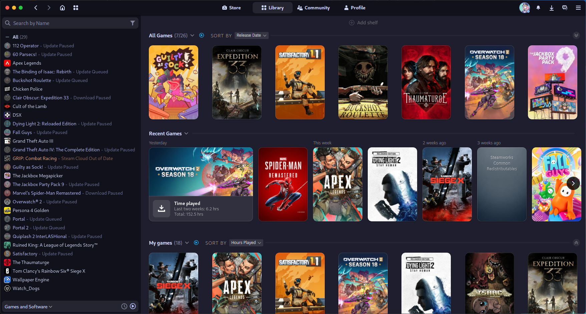
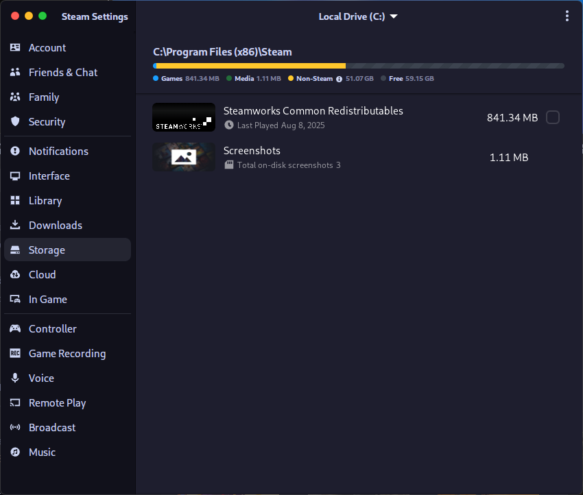
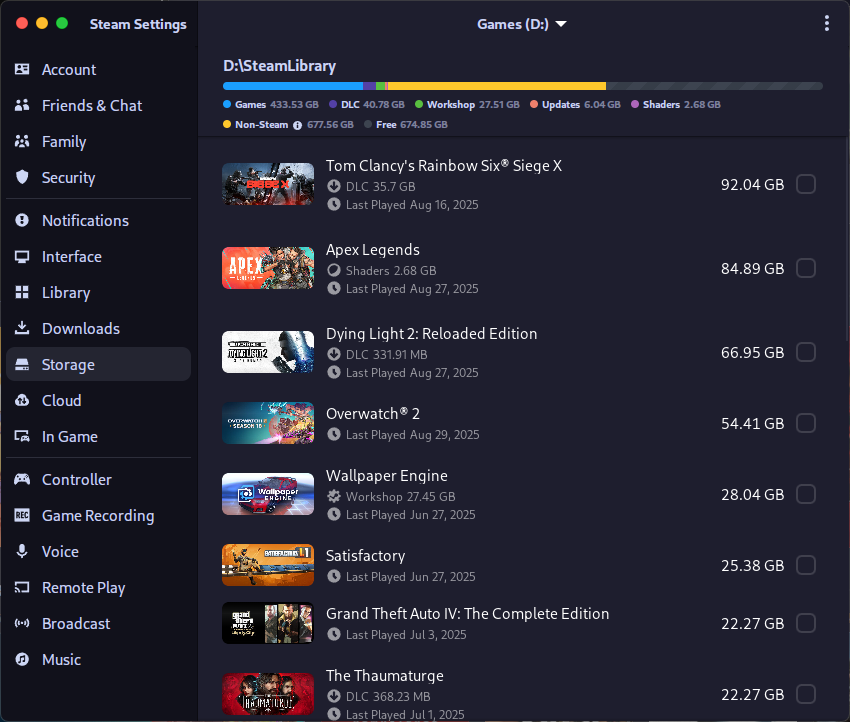
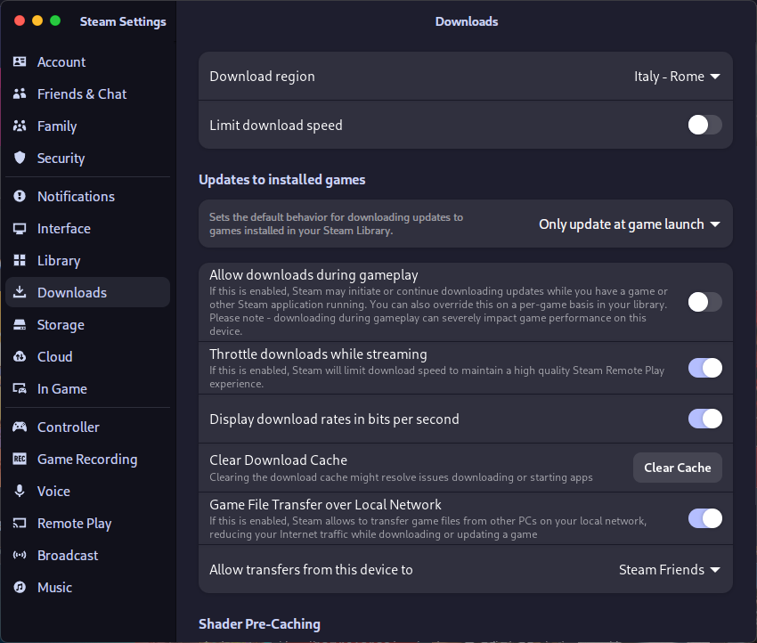

# Steam_exFATsymliker
A Python tool that symlinks Steam games and manifests from external drives (e.g. exFAT), so Steam can run them without duplication.

Instead of moving the entire Steam folder, this tool creates **symlinks for individual games and `.acf` (appmanifest) files**, so Steam sees them inside the default library (`~/.local/share/Steam`), while the actual data resides elsewhere.

## Why use it
- Avoid duplicating hundreds of GB of games.  
- Keep your main Steam folder clean without messy path changes.  
- Especially useful with exFAT drives (common for external disks), which lack native symlink support on Windows but can be managed through this method.

## Usage
```bash
# auto language selection
python3 steam_symlinker.py

# force a specific language
python3 steam_symlinker.py --lang en
python3 steam_symlinker.py --lang it
```

The tool launches an interactive (Italian/English) menu that automatically detects mounted **exFAT** libraries and guides you through:

1. **Update ACF symlinks** – refreshes manifests and game folders without touching existing files. At the end you see how many symlinks were created or refreshed.
2. **Force the ACF symlinks** – same as above, but it removes any conflicting files/directories first. Use this only when you know what you are doing.
3. **Fix `SteamLinuxRuntime_sniper`** – copies the runtime locally and recreates the expected symlink so Proton can find it. The script uses `rsync` when available for faster incremental updates.
4. **Export updated ACF files back to the exFAT drive** – copies Linux-side manifests back to the portable drive. The script warns you if newer manifests already exist on the drive before overwriting them.
5. **Append an `/etc/fstab` entry for the selected drive** – prepares a mount configuration matching the README example and appends it to `/etc/fstab` after asking for confirmation. This option requires root privileges.

The menu language is automatically selected between Italian and English using your system locale, but you can force it with `--lang`. If no exFAT library is detected you can still type the path manually.

### Cross-platform benefit
By symlinking appmanifests and game folders, you can share **a single installation** of your Steam games between Linux and Windows.
This works best if the shared library is stored on a filesystem accessible from both OS.

## How it works
The script:
1. Reads the main Steam library (`~/.local/share/Steam/steamapps`).
2. Creates symlinks for installed games located in the external library.
3. Creates symlinks for `appmanifest_*.acf` files, so Steam recognizes the games as “installed”.
4. Leaves the `~/.steam` folder and internal structure untouched (it does **not** symlink the whole Steam directory).

Example: ~/.local/share/Steam/steamapps/ -> /run/media/matt/Games/SteamLibrary/steamapps/

## Requirements
- Python3
- Basic familiarity with file paths

## Mounting the external drive

For symlinks to remain valid, the external drive must always be mounted at the same path.  
The recommended way is to add it to `/etc/fstab`

Below is an example from my setup:

`LABEL=Games /run/media/matt/Games auto rw,nofail,x-systemd.automount,nosuid,nodev,relatime,uid=1000,gid=1000,fmask=0022,dmask=0022,umask=000,iocharset=utf8,errors=remount-ro,x-gvfs-show,exec 0 0`


### Explanation
- **LABEL=Games** → identifies the drive by its filesystem label (“Games”). You can also use `UUID=` for extra reliability.  
- **/run/media/matt/Games** → the fixed mount point where the drive will appear. This must match the path used by the symlinks.  
- **auto** → filesystem type is detected automatically.  
- **rw** → mount with read/write permissions.  
- **nofail** → boot won’t fail if the drive is missing or unplugged.  
- **x-systemd.automount** → systemd will mount the drive automatically when accessed, no need to mount it manually.  
- **nosuid,nodev** → security flags: don’t allow setuid binaries or device files from this drive.  
- **relatime** → optimized timestamp updates (less writes than `atime`).  
- **uid=1000,gid=1000** → set ownership to user `1000` (your main account).  
- **fmask=0022,dmask=0022,umask=000** → control file and directory permissions so Steam can read/write.  
- **iocharset=utf8** → ensures proper filename encoding.  
- **errors=remount-ro** → if errors occur, remount read-only to prevent corruption.  
- **x-gvfs-show** → makes the drive visible in file managers like GNOME Files or Dolphin.  
- **exec** → allow executing binaries (needed for some games).  
- **0 0** → skip dump and fsck at boot for this drive.  

This configuration ensures:
- The drive always mounts under the same path.  
- The user has proper ownership/permissions to let Steam create symlinks.  
- The system won’t hang if the drive is not connected at boot.  

## Expected behavior

If everything is set up correctly, Steam will show the games as installed in the **local library** (`~/.local/share/Steam`) even though they physically reside on the external drive (`/run/media/.../Games/SteamLibrary`).

### Linux 

**Steam local library view**  


**External Steam library view**  


## What you see in your file manager

Even though Steam shows the game inside its local library, the actual files are not there.  
Instead, they are symlinked to the external drive.

**Local folder (Apex Legends appears, but it’s just a symlink)**  


**External drive (Apex Legends real files, ~82 GB)**  


Konsole output: symlink vs real folder size (Apex Legends)


Steam shows the games as installed, even though they physically reside on the external drive.  


### Windows
On Windows, the same external library is detected, and games can be launched without reinstallation. However, some additional settings are required to ensure proper synchronization between Linux and Windows.

**Steam library on Windows (showing Apex Legends as installed)**  
  
*In Windows, if games are updated on Linux, they may appear as pending updates in Steam on Windows because the `.acf` files are stored inside Linux local Steam folder.*

**Local Steam folder on Windows**  
  
*Windows local folder, as you can see it's empty.*

**External Steam library on Windows (real Apex Legends folder)**  
  
*The actual game files reside in the external library on the drive.*

### Download Settings (Windows/Secondary OS)
To prevent Steam from downloading games again after moving or symlinking, make sure to configure your settings correctly on the secondary OS (Windows in this case).

**Setting up Steam for downloads on Windows**  
  
*Ensure that Steam on the secondary OS is set to "Only update games on launch" to avoid unnecessary downloads.*


## Special case: SteamLinuxRuntime_sniper

Some Proton versions depend on the `SteamLinuxRuntime_sniper` environment. If this runtime lives only on the external drive, Steam may fail to detect it. Use **option 3** in the script to copy the runtime locally and recreate the expected symlink automatically. When `rsync` is installed the script leverages it to speed up subsequent synchronizations; otherwise it falls back to a full copy.

## TL;DR
- It does not symlink the entire Steam folder, only games and manifest files.
- If you move or rename game directories on the external drive, links will break and need to be recreated.
- Steam sometimes rewrites .acf files; this script helps restore them properly when that happens.
- The external Steam library must be added inside Steam settings → Storage. Otherwise Steam won’t know about it and the symlinks won’t be valid.
- On a dual-boot setup, disable automatic updates of the shared games on the secondary OS.
- Steam on Windows won’t see the updated .acf files from Linux for obvious reasons.
- To avoid conflicts, set on your secondary system to “Only update games on launch”.

## Acknowledgments
Made with a lot of trial, error, symlinks… and the help of an AI assistant (ChatGPT, sorry guys.).  
If the interface looks a bit different, it's because I've installed [Millennium](https://github.com/SteamClientHomebrew/Millennium) and used the [Adwaita for Steam](https://github.com/tkashkin/Adwaita-for-Steam).  
These themes give a different look to the Steam client and the overall environment.

## Licence
MIT License – free to use, modify, and redistribute.
