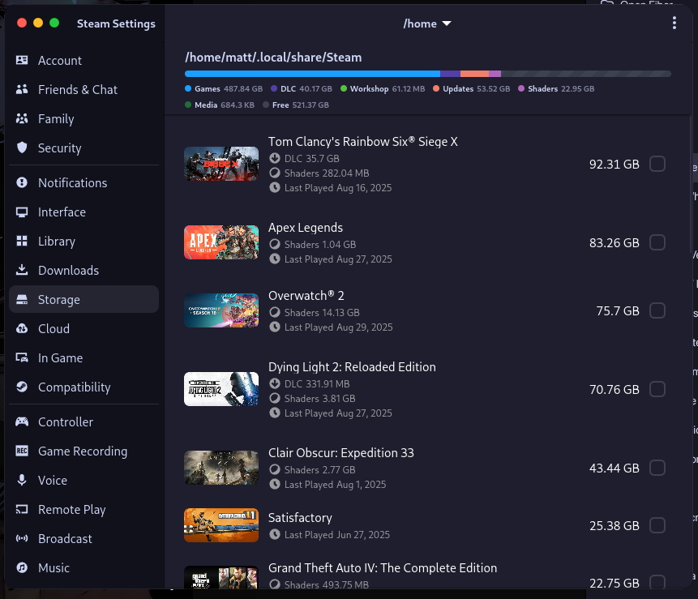
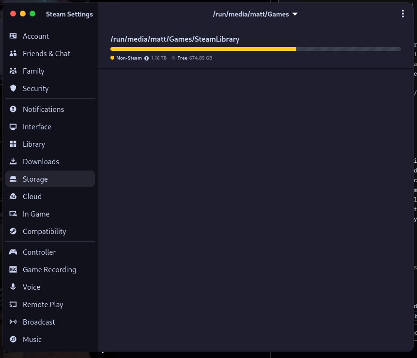
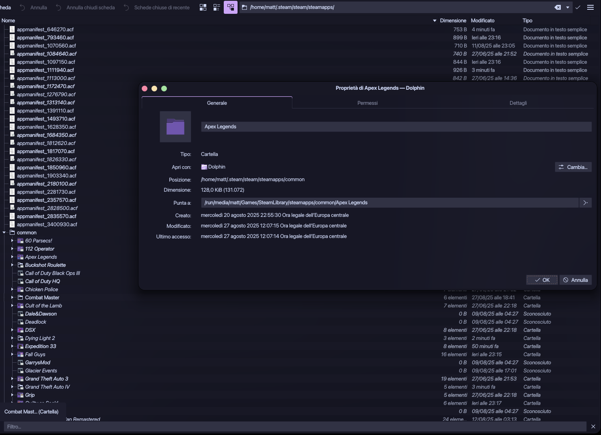
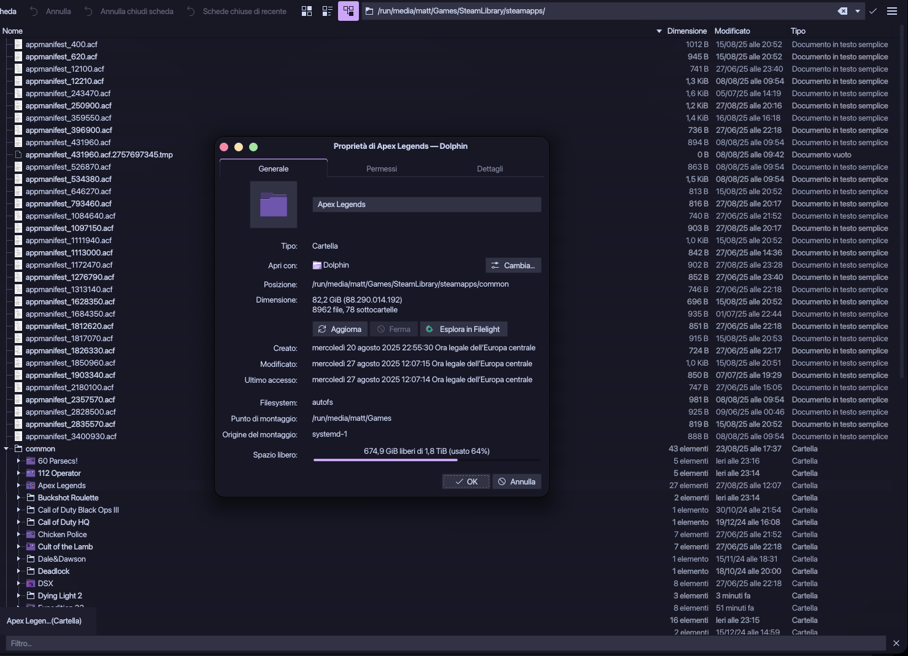
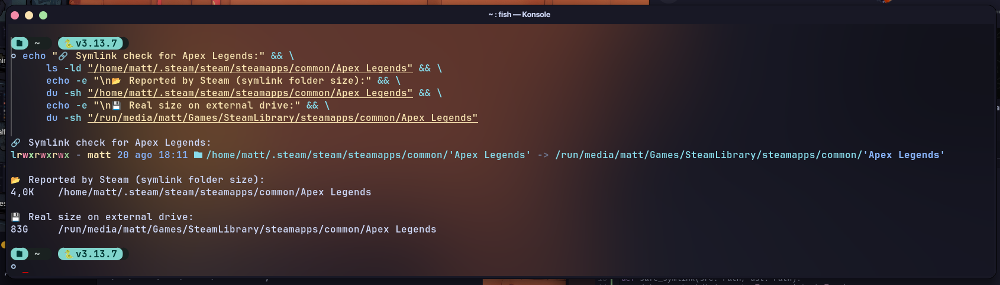

# Steam_exFATsymliker
A tool that lets you run Steam games stored on filesystems that don’t support symlinks.

Instead of moving the entire Steam folder, this tool creates **symlinks for individual games and `.acf` (appmanifest) files**, so Steam sees them inside the default library (`~/.local/share/Steam`), while the actual data resides elsewhere.

## Why use it
- Avoid duplicating hundreds of GB of games.  
- Keep your main Steam folder clean without messy path changes.  
- Works with exFAT filesystems

### Cross-platform benefit
By symlinking appmanifests and game folders, you can share **a single installation** of your Steam games between Linux and Windows.  
This works best if the shared library is stored on a filesystem accessible from both OS (MAYBE works NTFS for Windows/Linux, or ext4 with proper drivers on Windows needs proper testing).

## How it works
The script:
1. Reads the main Steam library (`~/.local/share/Steam/steamapps`).
2. Creates symlinks for installed games located in the external library.
3. Creates symlinks for `appmanifest_*.acf` files, so Steam recognizes the games as “installed”.
4. Leaves the `~/.steam` folder and internal structure untouched (it does **not** symlink the whole Steam directory).

Example: ~/.local/share/Steam/steamapps/ -> /run/media/matt/Games/SteamLibrary/steamapps/

## Requirements
- Python3
- Basic familiarity with file paths

## Expected behavior

If everything is set up correctly, Steam will show the games as installed in the **local library** (`~/.local/share/Steam`) even though they physically reside on the external drive (`/run/media/.../Games/SteamLibrary`).

### Linux 

**Steam local library view**  


**External Steam library view**  


## What you see in Dolphin

Even though Steam shows the game inside its local library, the actual files are not there.  
Instead, they are symlinked to the external drive.

**Local folder (Apex Legends appears, but it’s just a symlink)**  


**External drive (Apex Legends real files, ~82 GB)**  


Here’s a Konsole output comparing the symlink and real folder size for Apex Legends.



Steam shows the games as installed, even though they physically reside on the external drive.  


### Windows
On Windows, the same external library is detected, and games can be launched without reinstallation.  

## Special case: SteamLinuxRuntime_sniper

Some Proton versions depend on the `SteamLinuxRuntime_sniper` environment.  
If this runtime is installed on the external drive only, Steam may fail to detect it.  

In this case, you can copy and symlink it manually:

```bash
mkdir -p ~/.steam/runtime/SteamLinuxRuntime_sniper \
&& rsync -a --info=progress2 "/PATH/TO/YOUR/DRIVE/SteamLibrary/steamapps/common/SteamLinuxRuntime_sniper/" ~/.steam/runtime/SteamLinuxRuntime_sniper/ \
&& ln -sfn ~/.steam/runtime/SteamLinuxRuntime_sniper ~/.steam/steam/steamapps/common/SteamLinuxRuntime_sniper
```

## Important notes
- It does not symlink the entire Steam folder, only games and manifest files.
- If you move or rename game directories on the external drive, links will break and need to be recreated.
- Steam sometimes rewrites .acf files; this script helps restore them properly when that happens.
- The external Steam library must be added inside Steam settings → Storage. Otherwise Steam won’t know about it and the symlinks won’t be valid.
- On a dual-boot setup, disable automatic updates of the shared games on the secondary OS.
- Steam on Windows won’t see the updated .acf files from Linux for obvious reasons.
- To avoid conflicts, set on your secondary system to “Only update games on launch”. in my case, Windows use is only for linux broken games, such as Apex Legends, Rainbow Six or Battlefield 6. 

## Usage
```bash
python3 steam_symlinker.py --source /PATH/TO/DRIVE --target ~/.local/share/Steam/steamapps 
```

## Licence
MIT License – free to use, modify, and redistribute.
